# GMALL 实时数据大屏项目

## 项目简介
本项目是基于“实时数仓4.0”概念构建的GMALL实时数据大屏，旨在通过实时数据处理和可视化技术，提供GMALL电商平台的关键业务指标（KPIs）和运营状态的实时监控。项目涵盖了数据采集、清洗、转换、存储以及最终的可视化展示，帮助业务人员快速了解平台运行情况，支持决策。

## 架构概览
项目整体架构遵循实时数据仓库的建设理念，数据从业务系统流入，经过各层处理最终汇聚到可视化大屏。

### 1. 维度层 (DIM 层)
维度数据是数据仓库的基础，为后续的汇总分析提供支撑。本项目的维度数据存储在HBase中。

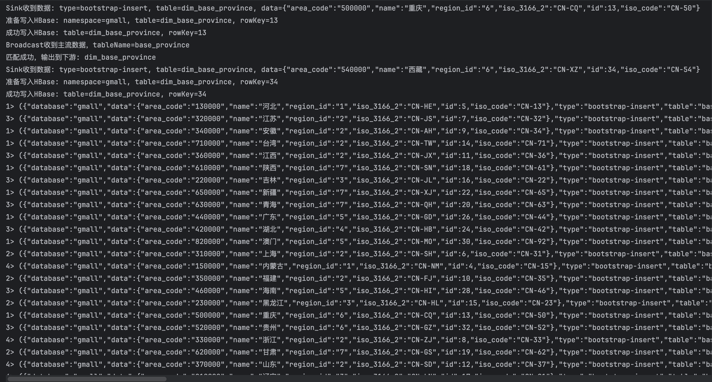
*DIM层数据存储在HBase示意图*

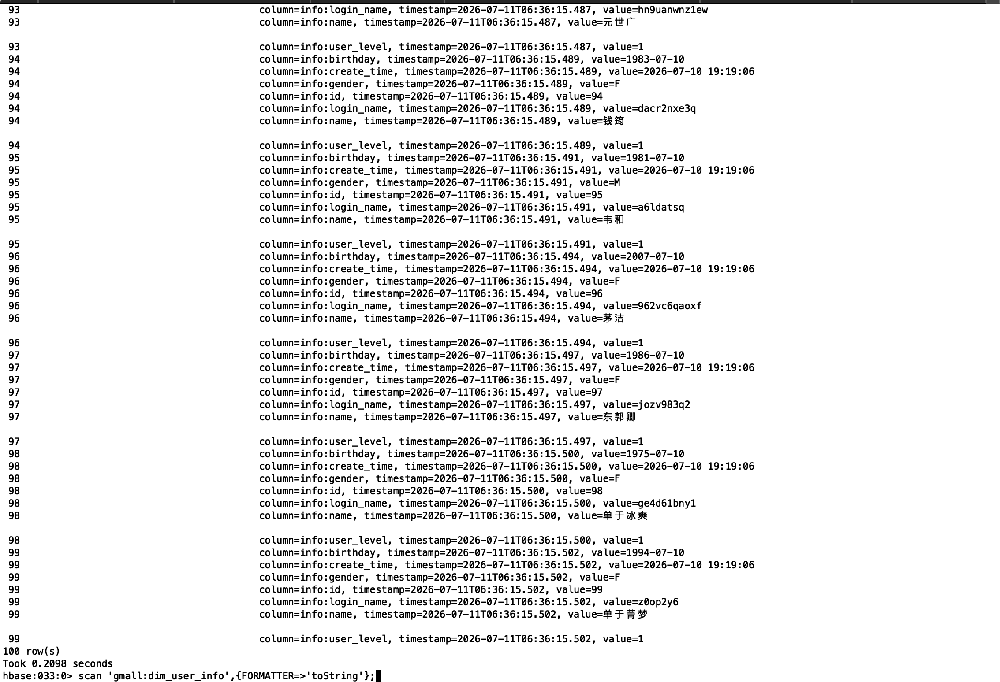
*HBase中DIM层数据示例*

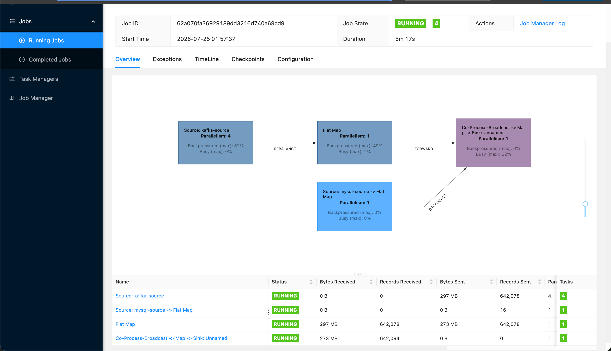
*DIM层管理UI界面示例*

### 2. 数据汇总层 (DWS 层)
DWS层是数据仓库的核心，通过对ODS层和DIM层数据的关联和聚合，形成主题域宽表，为数据分析和应用提供服务。本项目DWS层主要关注交易域和流量域的数据。

#### 交易域 DWS 表
*   **DWS 交易域加购各窗口汇总表**
    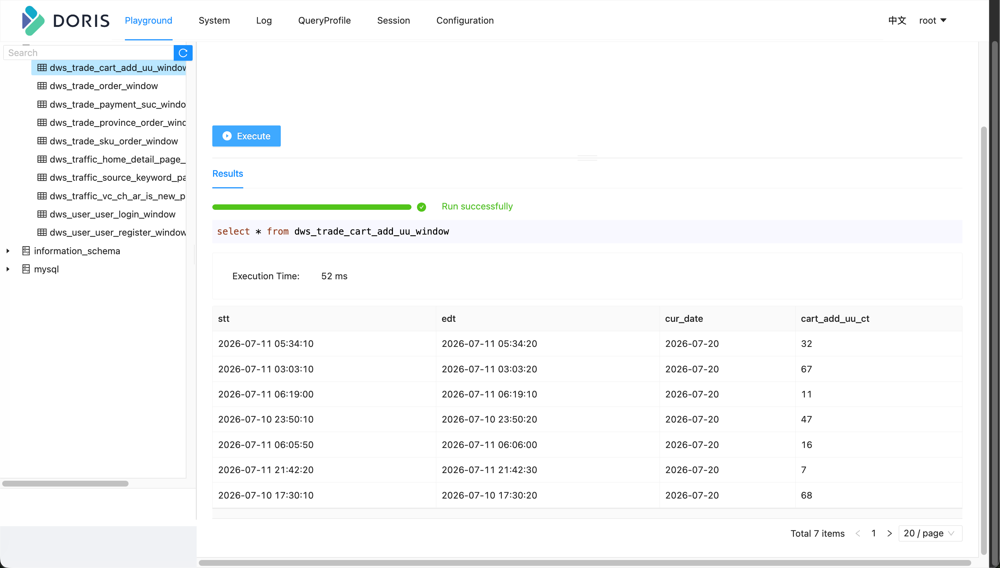
*   **DWS 交易域下单各窗口汇总表**
    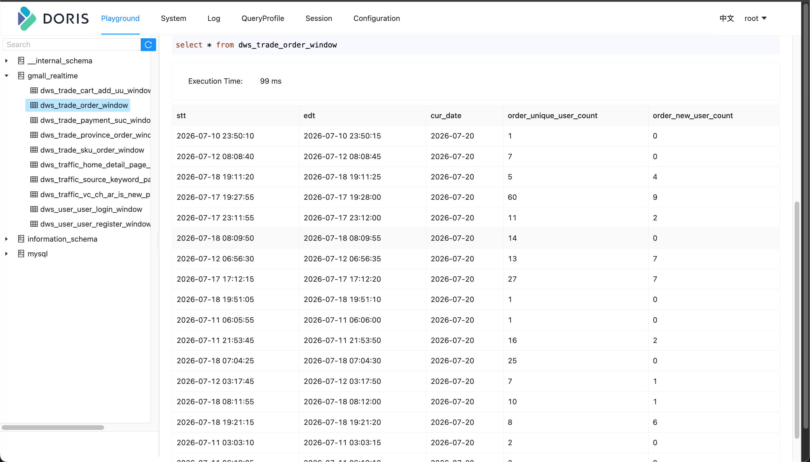
*   **DWS 交易域支付成功各窗口汇总表**
    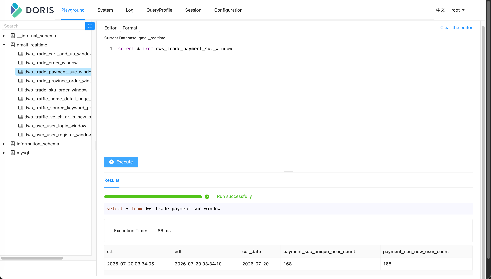
*   **DWS 交易域省份粒度下单各窗口汇总表**
    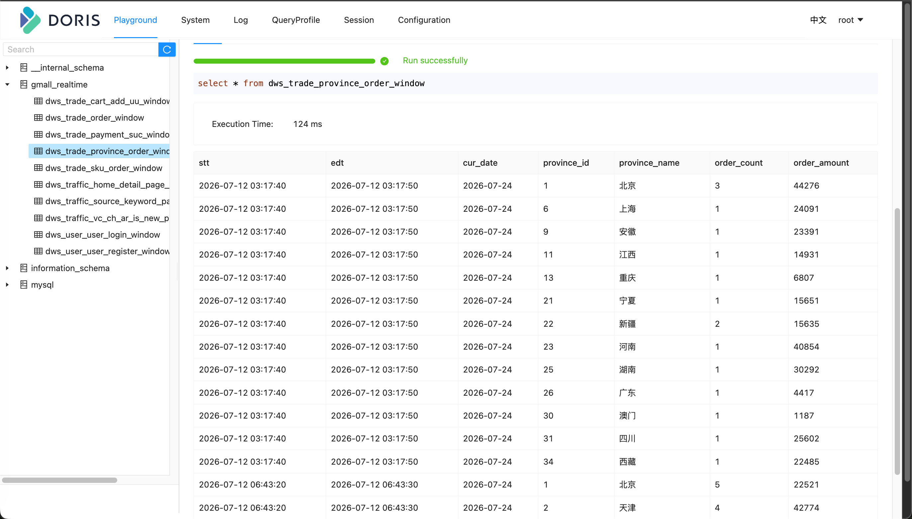
*   **DWS 交易域 SKU 粒度下单各窗口汇总表**
    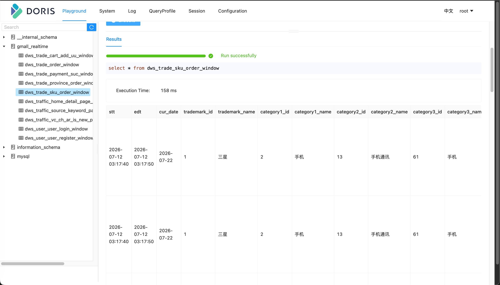

#### 流量域 DWS 表
*   **DWS 流量域首页、详情页页面浏览各窗口汇总表**
    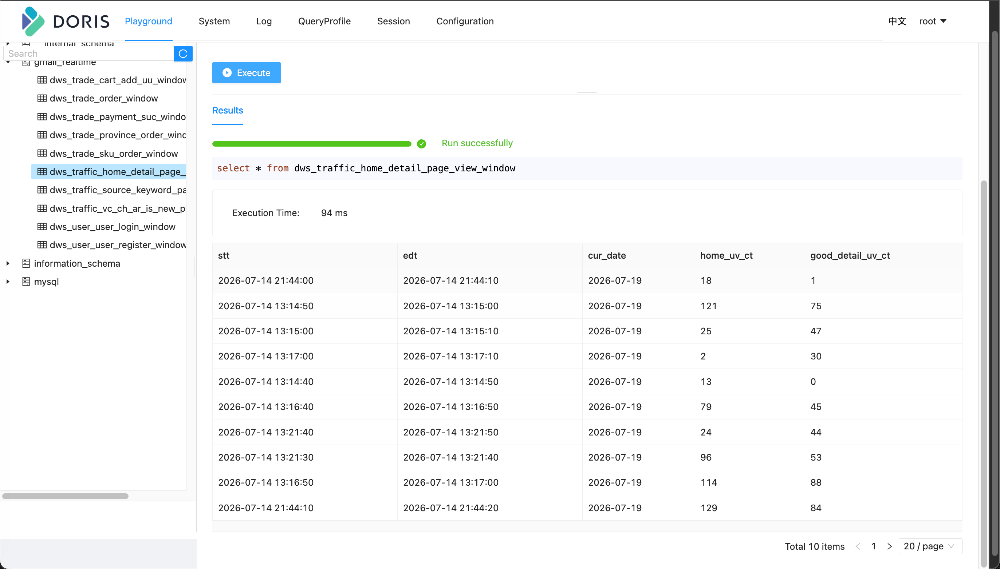
*   **DWS 流量域搜索关键词粒度页面浏览各窗口汇总表**
    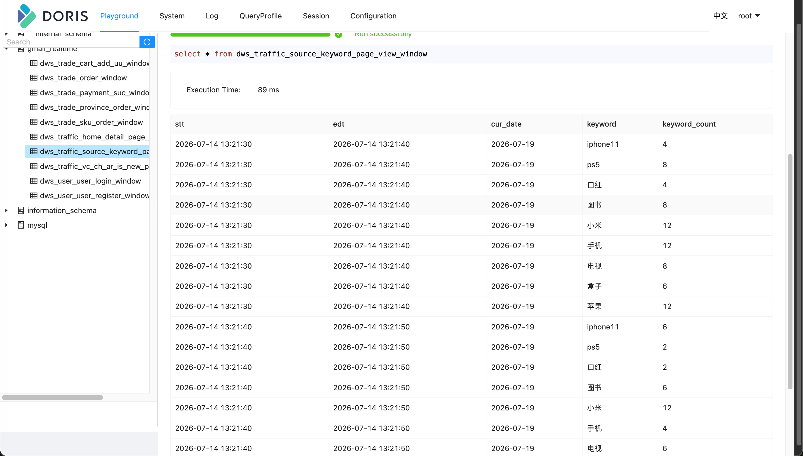
*   **DWS 流量域版本-渠道-地区-访客类别粒度页面浏览各窗口汇总表**
    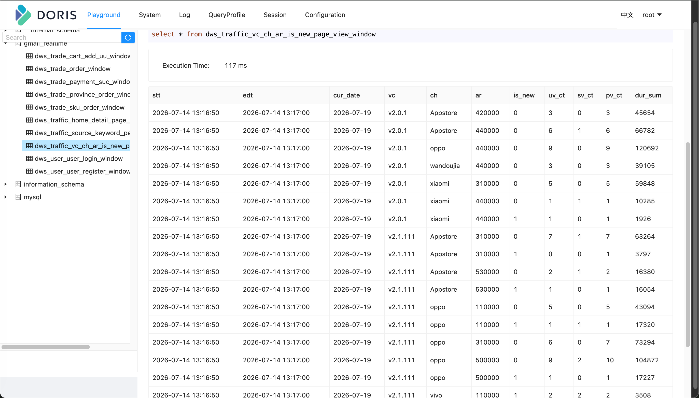

### 3. 用户域 DWS 表
*   **DWS 用户域用户注册各窗口汇总表**
    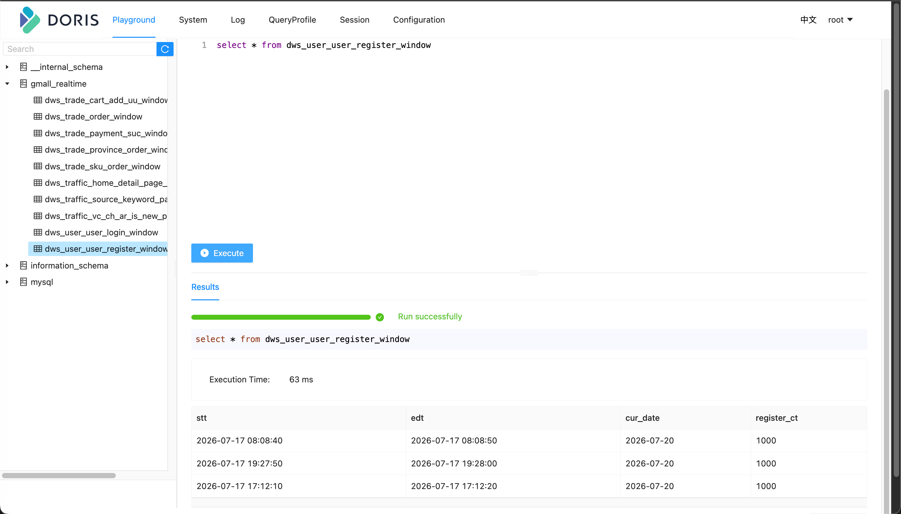

## 任务部署
项目中的实时处理任务可以通过 Apache Flink 配合 StreamPark 进行部署和管理。

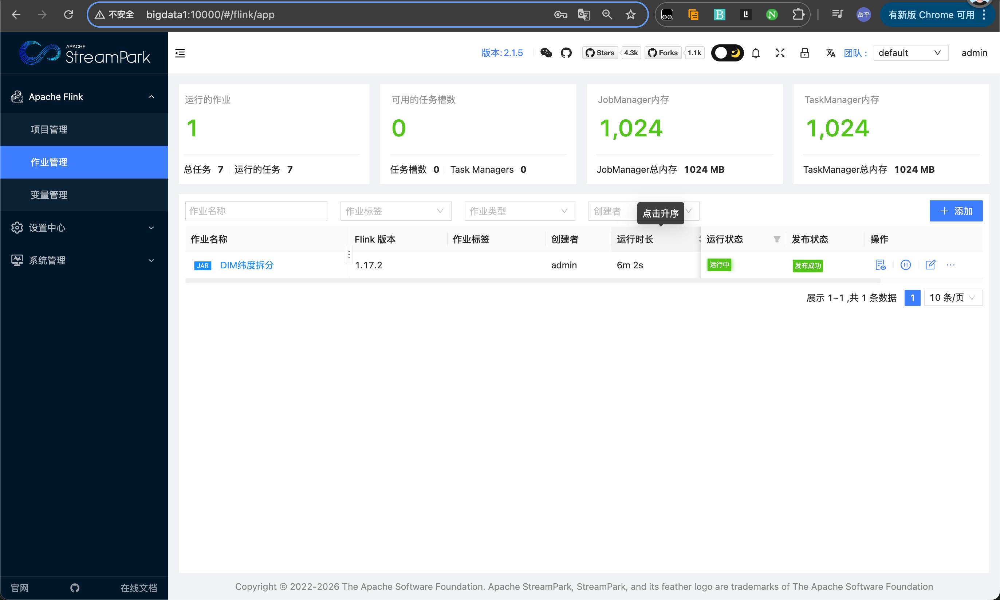
*StreamPark 上线 Flink 任务演示*

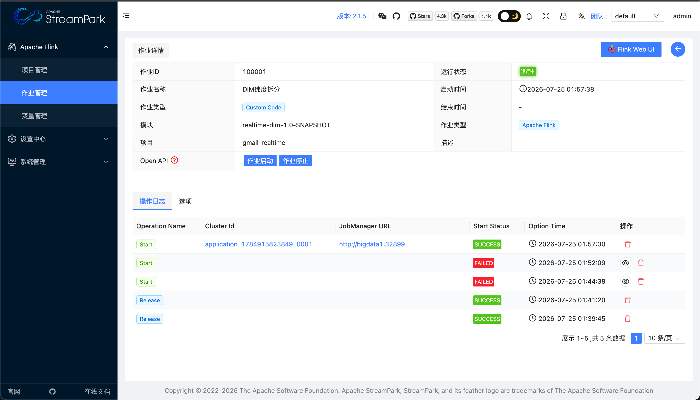
*StreamPark 任务状态查看*

## 可视化大屏
最终数据通过前端技术进行可视化展示，提供直观、实时的业务概览。

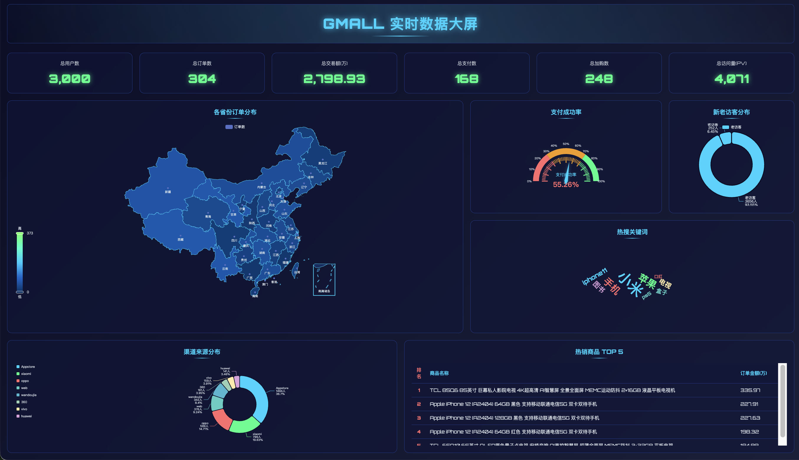
*GMALL 实时数据大屏最终效果图*

