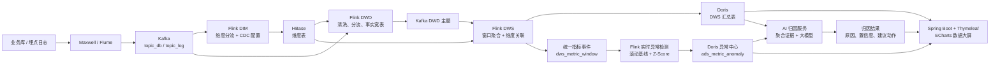
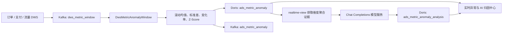

# GMALL 实时数仓

基于 Apache Flink 的 GMALL 电商实时数仓项目，覆盖实时数仓的 DIM、DWD、DWS 分层，并将 DWS 聚合结果写入 Doris，最后通过 Spring Boot + ECharts 实时展示业务指标。

本仓库是一个以学习和演示为主的 Java/Maven 多模块工程。配套的《尚硅谷大数据项目之电商实时数仓 V4.0》文档还包含数仓建模、ODS 采集、环境搭建、StreamPark 部署等完整课程内容；README 以当前仓库实际代码为准。

## 项目能力

- 使用 Flink DataStream / Flink SQL 处理 Kafka 实时数据。
- 使用 Flink CDC 监听 MySQL 配置表，实现维度处理规则动态加载。
- DIM 层将维度数据写入 HBase，并提供同步、异步维度关联能力。
- DWD 层完成日志清洗、日志分流、业务事实表过滤和宽表关联。
- DWS 层按时间窗口、用户、SKU、省份、关键词等粒度聚合指标，并写入 Doris。
- 内置实时异常检测链路，基于滚动基线、变化率和 Z-Score 自动识别指标突增/突降。
- 接入兼容 Chat Completions 的大模型，对异常进行证据约束的 AI 归因并给出处置建议。
- `realtime-view` 提供 GMALL 实时数据大屏和 REST API。
- SKU 下单任务保留普通维度关联、同步旁路缓存、异步旁路缓存等实现示例。

## 整体架构



典型数据链路如下：

```text
业务库 / 日志
  -> Kafka ODS（topic_db、topic_log）
  -> DIM：HBase 维度表
  -> DWD：Kafka 明细/事实主题
  -> DWS：Doris 窗口汇总表
  -> realtime-view：实时指标、趋势、TopN、分布和省份地图
```

## 模块说明

| 模块 | 类型 | 作用 |
| --- | --- | --- |
| `realtime-common` | 公共库 | 基类、Bean、常量、Kafka/HBase/MySQL/Redis/Doris 工具类和公共函数 |
| `realtime-dim` | Flink 任务 | 消费 `topic_db`，结合 `table_process_dim` 配置动态分流并写入 HBase |
| `realtime-dwd` | Maven 聚合模块 | 日志分流、评论、加购、下单、取消订单、支付成功、退款和基础表动态分流 |
| `realtime-dws` | Maven 聚合模块 | 流量、用户和交易主题的窗口聚合，结果写入 Doris |
| `realtime-dws-metric-anomaly-window` | Flink 任务 | 消费统一指标事件，维护在线基线并输出 P1/P2 异常 |
| `realtime-view` | Spring Boot 应用 | 查询 Doris，提供经营大屏、异常中心、AI 归因和 `/api` 数据接口 |

## 目录结构

```text
gmall-realtime/
├── pom.xml
├── realtime-common/
│   └── src/main/java/org/example/realtime/
│       ├── base/       # BaseAPP、BaseSQLAPP
│       ├── bean/       # 业务实体与配置实体
│       ├── constant/   # Kafka、MySQL、HBase、Redis、Doris 配置
│       ├── function/   # 维度关联与 Doris 映射函数
│       └── util/       # Source、Sink、SQL、HBase、Redis 等工具
├── realtime-dim/
│   └── .../DimAPP.java
├── realtime-dwd/
│   ├── realtime-dwd-base-log/
│   ├── realtime-dwd-base-db/
│   ├── realtime-dwd-interaction-comment-info/
│   └── realtime-dwd-trade-*/
├── realtime-dws/
│   ├── realtime-dws-traffic-*/
│   ├── realtime-dws-user-*/
│   ├── realtime-dws-trade-*/
│   └── realtime-dws-metric-anomaly-window/ # 实时异常检测
├── realtime-view/
│   ├── src/main/java/                    # Controller、Service、数据源配置
│   ├── src/main/resources/templates/     # dashboard.html
│   └── start.sh
└── src/main/resources/photo/              # 项目截图和效果图
```

## 技术栈

- Java 8
- Maven 多模块工程
- Apache Flink 1.17.1
- Kafka、MySQL、MySQL Binlog、Flink CDC
- HBase 2.4.11、Redis
- Doris（Flink Doris Connector 1.17）
- Hadoop 3.3.4（用于 HDFS / Checkpoint 场景）
- Spring Boot 2.7.18、Thymeleaf、JDBC、ECharts 5.4.0
- 兼容 OpenAI Chat Completions 协议的模型服务（如通义千问兼容模式）
- StreamPark（可选，用于集群任务发布和管理）

## 当前已实现的任务

### DIM

入口类：`realtime-dim/src/main/java/org/example/realtime/DimAPP.java`

- 输入：Kafka `topic_db`。
- 配置：MySQL `gmall_config.table_process_dim`。
- 处理：广播配置、动态创建/删除 HBase 表、过滤字段、写入维度数据。
- 默认本地 Flink Web UI 端口：`10001`。

DIM 层处理结果和 HBase 中的维度数据示例：


### DWD

| 模块 | 入口类 | 输入 / 输出 |
| --- | --- | --- |
| `realtime-dwd-base-log` | `DwdBaseLog` | `topic_log` → `dwd_traffic_start`、`dwd_traffic_err`、`dwd_traffic_page`、`dwd_traffic_action`、`dwd_traffic_display` |
| `realtime-dwd-interaction-comment-info` | `DwdInterationCommonInfo` | `topic_db` → `dwd_interaction_common_info` |
| `realtime-dwd-trade-cart-add` | `DwdTradeCartAdd` | `topic_db` → `dwd_trade_cart_add` |
| `realtime-dwd-trade-order-detail` | `DwdTradeOrderDetail` | `topic_db` → `dwd_trade_order_detail` |
| `realtime-dwd-trade-order-cancel-detail` | `DwdTradeOrderCancelDetail` | `topic_db` → `dwd_trade_order_cancel_detail` |
| `realtime-dwd-trade-order-pay-suc-detail` | `DwdTradeOrderPaySucDetail` | `topic_db` → `dwd_trade_order_pay_suc_detail` |
| `realtime-dwd-trade-order-refund` | `DwdTradeOrderRefund` | `topic_db` → `dwd_trade_order_refund` |
| `realtime-dwd-base-db` | `DwdBaseDb` | `topic_db` → 根据 `table_process_dwd` 动态分流到 DWD 主题 |

### DWS

| 主题域 | 模块 | Doris 表 |
| --- | --- | --- |
| 流量 | `realtime-dws-traffic-source-keyword-page-view-window` | `dws_traffic_source_keyword_page_view_window` |
| 流量 | `realtime-dws-traffic-vc-ch-ar-is_new-page-view-window` | `dws_traffic_vc_ch_ar_is_new_page_view_window` |
| 流量 | `realtime-dws-traffic-home-detail-page-view-window` | `dws_traffic_home_detail_page_view_window` |
| 用户 | `realtime-dws-user-user-login-window` | `dws_user_user_login_window` |
| 用户 | `realtime-dws-user-user-register-window` | `dws_user_user_register_window` |
| 交易 | `realtime-dws-trade-cart-add-uu-window` | `dws_trade_cart_add_uu_window` |
| 交易 | `realtime-dws-trade-payment-suc-window` | `dws_trade_payment_suc_window` |
| 交易 | `realtime-dws-trade-order-window` | `dws_trade_order_window` |
| 交易 | `realtime-dws-trade-sku-order-window` | `dws_trade_sku_order_window` |
| 交易 | `realtime-dws-trade-province-order-window` | `dws_trade_province_order_window` |
| 智能监控 | `realtime-dws-metric-anomaly-window` | `ads_metric_anomaly` |

说明：课程文档中还出现了退单主题的 DWS 练习，但当前仓库的 `realtime-dws/pom.xml` 未声明对应模块，因此不把它列为已实现任务。

### DWS 结果示例

#### 交易域

交易域当前包含加购、下单、支付成功、省份和 SKU 粒度的窗口汇总：


#### 流量域

流量域当前包含首页/详情页、搜索关键词、版本/渠道/地区/访客类别等粒度的页面浏览汇总：


#### 用户域


## 环境准备

完整链路至少需要准备以下服务：

1. Zookeeper、Kafka。
2. MySQL，并开启 Binlog；业务数据和 `gmall_config` 配置库需要可访问。
3. Maxwell 或其他业务数据采集程序，将 MySQL 变更写入 `topic_db`。
4. Flume 或其他日志采集程序，将埋点日志写入 `topic_log`。
5. HBase，用于 DIM 维度表；Redis 用于部分 SKU 维度关联示例。
6. Doris，创建数据库 `gmall_realtime` 及对应 DWS 表。
7. HDFS 仅在启用 Flink Checkpoint 时需要；StreamPark 仅在集群部署时需要。

默认集群地址写在 `realtime-common/src/main/java/org/example/realtime/constant/Constant.java`，包括：

```text
Kafka:  bigdata1:9092,bigdata2:9092,bigdata3:9092
MySQL: bigdata1:3306
HBase:  bigdata1,bigdata2,bigdata3:2181
Redis:  bigdata1:6379
Doris:  bigdata1:8030（Flink Sink 使用）
```

可视化模块通过 `realtime-view/src/main/resources/application.yml` 连接 Doris，默认 JDBC 地址为 `bigdata1:9030`。这两个端口用途不同：`8030` 是 Doris FE HTTP/Stream Load 相关地址，`9030` 是 MySQL 协议查询端口；请根据实际 Doris 版本和部署方式核对。

## 构建项目

在项目根目录执行：

```bash
mvn clean package -DskipTests
```

单独构建可视化模块：

```bash
cd realtime-view
mvn clean package -DskipTests
```

## 本地运行顺序

实时任务的入口类使用硬编码参数启动，包括本地 Web UI 端口、Kafka 消费组、输入主题和目标表。建议按以下顺序启动：

1. 启动 Zookeeper、Kafka、MySQL、Maxwell / Flume、HBase、Doris。
2. 初始化 `gmall_config.table_process_dim`、`table_process_dwd`，并确认 HBase namespace `gmall` 存在。
3. 启动 `DimAPP`，确认维度数据进入 HBase。
4. 启动 DWD 任务，生成日志和业务事实主题。
5. 启动 DWS 任务，确认 Doris DWS 表产生数据。
6. 启动可视化模块，访问大屏。

在 IDEA 中直接运行对应模块的 `main` 方法即可。DWD/DWS 任务的本地 Web UI 端口通常按代码约定使用 `10011`、`10012`、`10013` 和 `10021` 起始的端口段；如果并行启动多个任务，请避免端口冲突。

## StreamPark 部署示例

课程文档中使用 StreamPark 管理 Flink 集群任务。仓库中的截图展示了任务上线和运行状态，实际部署仍需要先准备 StreamPark、Flink 集群、HDFS 以及对应的依赖包。


## 启动实时大屏

推荐使用 Maven：

```bash
cd realtime-view
mvn spring-boot:run
```

或打包后运行：

```bash
cd realtime-view
mvn clean package -DskipTests
java -jar target/realtime-view-1.0-SNAPSHOT.jar
```

启动后访问：<http://localhost:8080/>

## 实时异常检测与 AI 归因

这是本项目新增的核心 AI 能力：它不是让大模型直接判断原始数据是否异常，而是采用
**Flink 确定性检测 + 大模型证据归因**的两阶段方案。Flink 负责低延迟、可解释地发现异常，
大模型只负责根据已经确认的异常指标和聚合维度证据解释原因，从而降低幻觉和数据泄露风险。

### 核心能力

- **实时检测**：订单用户数、支付成功用户数和多维 PV 统一进入 Kafka 指标主题。
- **在线基线**：按“指标编码 + 维度键”独立维护最近 60 个正常窗口，不依赖离线训练。
- **异常分级**：变化率绝对值达到 60% 标记为 P1，其余规则命中的异常标记为 P2。
- **AI 归因**：自动补充省份、渠道、版本、新老访客等聚合证据，生成原因、置信度和建议动作。
- **安全约束**：模型不连接 Doris、不读取用户明细，只接收后端组装的聚合证据。
- **闭环展示**：大屏支持异常列表、AI 服务状态、自动归因、立即归因、失败重试和结果回看。

### 处理链路



### 异常检测规则

订单人数、支付成功人数和多维 PV 会被标准化为统一的 `MetricWindowEvent`，写入 Kafka
`dws_metric_window`。`DwsMetricAnomalyWindow` 为每个“指标 + 维度”维护滚动基线，满足以下
全部条件时生成异常：

- 基线至少积累 12 个窗口；
- 当前值相对基线变化不低于 35%；
- 标准差为 0，或 Z-Score 绝对值不低于 3；
- 同一指标维度距上次告警超过 5 分钟。

异常点不会写回基线，避免一次突刺把后续基线整体拉偏。异常 ID 根据“指标 + 维度 + 窗口”
稳定生成，结果同时写入 Doris `ads_metric_anomaly` 和 Kafka `ads_metric_anomaly`。

| 参数 | 当前值 | 说明 |
| --- | --- | --- |
| 最少基线样本 | 12 | 基线不足时只学习，不告警 |
| 最大基线窗口 | 60 | 控制基线对近期业务变化的敏感度 |
| 最小变化率 | 35% | 过滤业务正常波动 |
| 最小 Z-Score | 3 | 判断当前值是否显著偏离历史分布 |
| 告警冷却时间 | 5 分钟 | 避免同一指标持续刷屏 |
| P1 阈值 | 60% | 大幅突增或突降升级为 P1 |

### 初始化与启动

先创建异常事件表和 AI 归因结果表：

```bash
mysql -h bigdata1 -P 9030 -u root < src/main/resources/anomaly_sql.sql
```

两张核心表的职责：

| Doris 表 | 作用 |
| --- | --- |
| `ads_metric_anomaly` | 保存异常值、基线值、变化率、Z-Score、级别和检测证据 |
| `ads_metric_anomaly_analysis` | 保存模型、结构化归因、维度证据、执行状态和错误信息 |

启动订单、支付、流量 DWS 任务并确认 `dws_metric_window` 有数据后，再运行异常检测入口：

```text
org.example.realtime.dws.app.DwsMetricAnomalyWindow
```

### 配置 AI 归因

AI 归因位于 `realtime-view`，支持兼容 Chat Completions 的模型服务。`AI_ATTRIBUTION_ENDPOINT`
必须是完整的 `/chat/completions` 地址，而不是只填写 `/v1`。例如使用阿里云 DashScope 兼容模式：

```bash
AI_ATTRIBUTION_ENABLED=true \
AI_ATTRIBUTION_ENDPOINT='https://dashscope.aliyuncs.com/compatible-mode/v1/chat/completions' \
AI_ATTRIBUTION_API_KEY='sk-your-api-key' \
AI_ATTRIBUTION_MODEL='qwen-plus' \
mvn -pl realtime-view spring-boot:run
```

> API Key 只通过环境变量注入，不要提交到 `application.yml`、README、日志或 Git 历史中。
> 如果密钥曾出现在终端截图、聊天记录或仓库中，应立即到模型服务控制台撤销并重新生成。

完整配置项如下：

| 环境变量 | 默认值 | 作用 |
| --- | --- | --- |
| `AI_ATTRIBUTION_ENABLED` | `false` | 是否启用自动/手动 AI 归因 |
| `AI_ATTRIBUTION_ENDPOINT` | 空 | Chat Completions 完整接口地址 |
| `AI_ATTRIBUTION_API_KEY` | 空 | Bearer API Key |
| `AI_ATTRIBUTION_MODEL` | 空 | 模型名称，例如 `qwen-plus` |
| `AI_ATTRIBUTION_FIXED_DELAY_MS` | `60000` | 自动扫描待归因异常的间隔 |
| `AI_ATTRIBUTION_BATCH_SIZE` | `10` | 单次扫描处理数量，最大限制为 50 |
| `AI_ATTRIBUTION_MAX_ATTEMPTS` | `3` | 单条异常最大尝试次数，最大限制为 10 |
| `AI_ATTRIBUTION_CONNECT_TIMEOUT_MS` | `5000` | 模型服务连接超时 |
| `AI_ATTRIBUTION_READ_TIMEOUT_MS` | `30000` | 模型响应读取超时 |
| `AI_ATTRIBUTION_JSON_RESPONSE_FORMAT_ENABLED` | `true` | 是否请求模型返回 JSON Object |

服务通过 `Authorization: Bearer <API_KEY>` 调用模型。模型必须返回兼容
`choices[0].message.content` 的响应；代码也兼容部分服务返回的顶层 `text` 字段。

### 归因结果约束

模型收到的内容由服务端生成，包含异常指标、窗口、当前值、基线、变化率、Z-Score，以及与指标
对应的聚合维度证据。返回结果必须是 JSON，并包含：

```json
{
  "summary": "异常概述",
  "probableCauses": [
    {
      "cause": "可能原因",
      "confidence": 0.8,
      "evidence": "支持该判断的聚合证据"
    }
  ],
  "recommendedActions": ["建议动作一", "建议动作二"]
}
```

其中 `confidence` 范围为 0 到 1。证据不足时模型必须明确说明，不能将猜测描述为已确认事实。

### 前端与接口

大屏右侧的“实时异常告警”和“AI 智能归因”区域展示 24 小时异常数、P1 数、待归因数、AI
服务状态和最新归因结论。点击异常可以切换详情，并支持立即归因、重新归因和失败重试。

| 方法 | 路径 | 说明 |
| --- | --- | --- |
| `GET` | `/api/anomalies?limit=20` | 最近异常及最新归因状态 |
| `GET` | `/api/anomalies/summary` | 24 小时异常统计与 AI 配置状态 |
| `GET` | `/api/anomalies/{anomalyId}/analysis` | 单条异常的最新归因结果 |
| `POST` | `/api/anomalies/{anomalyId}/analyze` | 手动触发单条异常归因 |

手动验证示例：

```bash
# 查看 AI 服务是否可用、是否存在待归因异常
curl http://localhost:8080/api/anomalies/summary

# 查看最近异常
curl 'http://localhost:8080/api/anomalies?limit=20'

# 对指定异常立即执行归因
curl -X POST \
  http://localhost:8080/api/anomalies/<anomalyId>/analyze

# 查询最新归因结果
curl \
  http://localhost:8080/api/anomalies/<anomalyId>/analysis
```

归因记录的典型状态：

| 状态 | 含义 | 建议 |
| --- | --- | --- |
| `COMPLETED` | 已取得并保存结构化归因结果 | 在大屏查看原因、置信度和建议动作 |
| `FAILED` | 模型调用、响应解析或 Doris 写入失败 | 查看 `error_message` 和应用日志后重试 |
| 无记录 | 异常尚未被自动任务扫描 | 等待定时任务或点击“立即归因” |

### 常见问题

- **模型请求返回 404**：检查 endpoint 是否包含完整的 `/chat/completions`。
- **提示未提供 API Key**：请求头必须是 `Authorization: Bearer <API_KEY>`；应用会自动添加该请求头。
- **响应中没有 `choices`**：确认服务是否真正兼容 Chat Completions；顶层 `text` 仅作为兼容兜底。
- **Doris 提示 strict mode filtered data**：检查 `analysis_json`、`evidence_json` 和 `error_message` 字段长度，
  并执行最新的 `src/main/resources/anomaly_sql.sql` 表结构升级语句。
- **前端显示“归因失败，可重试”**：查询 `/analysis` 接口中的 `status` 和 `error_message`，同时查看
  `realtime-view/logs/realtime-view.log`。
- **AI 服务显示 OFFLINE**：确认四项必需配置 `enabled`、`endpoint`、`api-key`、`model` 均已生效，
  修改环境变量后需要重启 Spring Boot 应用。

`realtime-view/src/main/resources/application.yml` 支持通过环境变量覆盖 Doris 连接：

```bash
export DORIS_FENODES=bigdata1:9030
export DORIS_DATABASE=gmall_realtime
export DORIS_USERNAME=root
export DORIS_PASSWORD='你的密码'
```

当前实际提供的接口如下：

| 接口 | 作用 |
| --- | --- |
| `GET /api/dashboard/overall` | 用户、订单、金额、PV、支付、加购总览 |
| `GET /api/dashboard/trend?metric=user_register&timeRange=24%20HOUR` | 注册、订单或 PV 趋势 |
| `GET /api/dashboard/map` | 省份订单地图数据 |
| `GET /api/dashboard/payment-success-rate` | 支付成功率 |
| `GET /api/charts/topN?...` | TopN 聚合数据 |
| `GET /api/charts/distribution?...` | 分布聚合数据 |

日志默认写入：`realtime-view/logs/realtime-view.log`。

大屏效果示例：


## 代码阅读路线

如果你是第一次阅读本项目，建议按以下顺序：

1. 先看 `realtime-common` 的 `Constant`、`BaseAPP`、`BaseSQLAPP`、`FlinkSourceUtil` 和 `FlinkSinkUtil`。
2. 再看 `realtime-dim/DimAPP.java`，理解配置驱动的维度分流与 HBase Sink。
3. 以 `realtime-dwd-base-log/DwdBaseLog.java` 理解日志 ETL、侧输出流和 Kafka 分流。
4. 以 `DwdTradeOrderDetail` 理解 Flink SQL 多表关联和 DWD 订单明细。
5. 以 `DwsTradeOrderWindow`、`DwsTradeProvinceOrderWindow` 理解窗口聚合与 Doris Sink。
6. 最后阅读 `realtime-view` 的 `DataController`、`DashboardService` 和 `dashboard.html`。

## 已知限制与使用提示

- 集群地址、MySQL 账号等部分配置仍直接写在 `Constant.java` 中，部署前请按环境修改，避免使用默认密码。
- `BaseAPP` 和 `BaseSQLAPP` 中的状态后端、Checkpoint 配置目前被注释；不要据此认为当前本地运行已经具备完整的故障恢复能力。
- `realtime-view/start.sh` 内含本机绝对路径，跨机器使用前应先改为项目相对路径；更推荐使用上面的 Maven 启动命令。
- 浏览器页面依赖 jsDelivr 加载 ECharts 资源，离线环境需要改成本地静态资源。
- `realtime-dws-trade-sku-order-window` 下保留了普通、同步缓存、异步缓存三种实现示例；当前默认入口是 `DwsTradeSkuOrderWindow`，另外两个类更适合对比学习和实验。
- 仓库包含少量课程练习代码和历史命名差异，实际部署时应以各模块 `pom.xml` 和入口类为准。

## 配套课程内容

说明文档的主要学习主线是：

```text
数据仓库与维度建模
  -> ODS / Kafka 数据采集
  -> DIM 维度设计与 HBase
  -> DWD 事实表与业务过程
  -> DWS 指标体系与窗口聚合
  -> Doris 明细/汇总存储
  -> StreamPark 发布与 Flink 作业管理
```

仓库代码重点对应 DIM、DWD、DWS 和可视化部分；环境初始化、数据生成器、Maxwell/Flume 脚本及部分集群部署步骤需要结合课程文档或你自己的大数据集群补齐。
